  <picture>
    <source media="(prefers-color-scheme: dark)" srcset="assets/hero-dark.svg">
    
  </picture>

  

    <a href="https://my-portfolio-hrdk2.vercel.app"><b>Portfolio</b></a> &nbsp;&middot;&nbsp;
    <a href="https://www.linkedin.com/in/hardik-gaonkar-b7706a376"><b>LinkedIn</b></a> &nbsp;&middot;&nbsp;
    <a href="mailto:hardikgaonkar2025@gmail.com"><b>Email</b></a> &nbsp;&middot;&nbsp;
    <a href="https://github.com/hrdk6/MyPortfolio/raw/HEAD/assets/Hardik_Gaonkar_Resume.pdf"><b>Résumé</b></a>
  

AI & ML undergraduate at **BMS Institute of Technology and Management, Bengaluru** (B.E., 2028). I build AI systems end to end and don't call one finished until a held-out benchmark says it works. Open to **AI/ML engineering internships**.

## Featured work

| Project | What it does | Proof |
| :-- | :-- | :-- |
| **[AegisOps](https://github.com/hrdk6/AegisOps)** Go · Kubernetes · FastAPI · OpenTelemetry | Autonomous incident-response agent for Kubernetes. Detects SLO violations, cites evidence from metrics, logs and traces, fixes the cause and verifies recovery. A deterministic Go policy engine bounds what it may do; risky fixes run in a sandbox first. | **76% → 100%** pass rate on 21 live injected failures **0** unsafe actions · **140s** median recovery |
| **[CareFlow AI](https://github.com/hrdk6/CareFlow-AI)** FastAPI · pgvector · XGBoost · ONNX · Next.js | Clinical AI platform. The LLM only sees records the signed-in user may access, and patient identities are masked before any cloud call. Adds explainable risk models and chest X-ray triage. | **0.955** Recall@1 · **0.977** MRR **0.71–0.80** X-ray ROC-AUC |
| **[PatchPilot](https://github.com/hrdk6/PatchPilot)** LangGraph · Docker · Qdrant · React | Turns a repository and a bug report into a tested patch. Plans, patches and tests in a locked-down sandbox, feeding failures back into a budget-capped repair loop. | **537** tests · pass rate with **Wilson 95%** CIs |
| **[GroundTruth](https://github.com/hrdk6/GroundTruth)** pgvector · BM25 in SQL · Next.js | Self-verifying RAG over Kubernetes docs. Checks every generated sentence against its source, then regenerates or declines to answer. | **0.94–0.97** faithfulness **13** measurement bugs caught by self-audit |

<b>More projects</b>

 

- **[FieldNote](https://github.com/hrdk6/FieldNote)**: market and competitor intelligence. Four agents research, critique, analyze and write, and every claim carries a source.
- **[AI Council](https://github.com/hrdk6/AI-Council)**: a panel of AI specialists debates a hard decision in parallel, then a chairman writes one directive.
- **[MyPortfolio](https://github.com/hrdk6/MyPortfolio)**: my portfolio site, hand-written HTML, CSS and a WebGL liquid-glass background.

## Toolbox

| | |
| :-- | :-- |
| **Languages** | Python · Go · TypeScript · JavaScript · SQL |
| **GenAI** | RAG · hybrid search · reranking · LLM agents · LangGraph · LLM evaluation · guardrails |
| **ML** | scikit-learn · XGBoost · SHAP · Hugging Face · ONNX Runtime · transfer learning |
| **Backend & infra** | FastAPI · PostgreSQL · pgvector · Qdrant · Docker · Kubernetes · Prometheus · GitHub Actions |
| **LLM platforms** | Claude · OpenAI · Gemini · Groq · NVIDIA NIM · Ollama |
